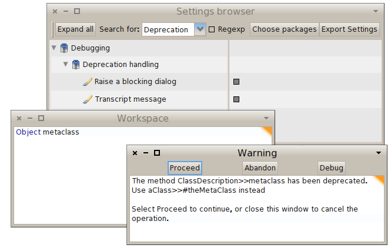
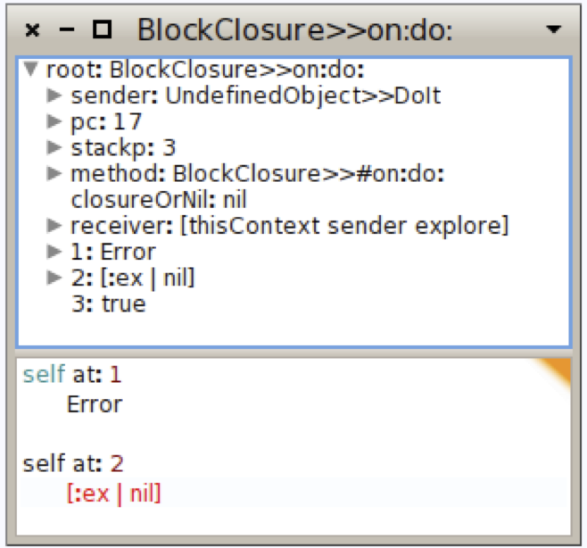

## Handling Exceptions
@cha:exception


All applications have to deal with exceptional situations.

Arithmetic errors may occur (such as division by zero), unexpected situations may arise (file not found), or resources may be exhausted (network down, disk full, etc.). The old-fashioned solution is to have operations that fail return a special *error code*; this means that client code must check the return value of each operation, and take special action to handle errors. This leads to brittle code.

With the help of a series of examples, we shall explore all of these possibilities, and take a closer look into the internal mechanics of exceptions and exception handlers.

### Introduction

Modern programming languages, including Smalltalk, offer a dedicated exception-handling mechanism that greatly simplifies the way in which exceptional situations are signaled and handled.

Before the development of the **ANSI Smalltalk** standard in 1996, several exception handling mechanisms existed, mostly incompatible with each other. Pharo's exception handling follows the ANSI standard, with some embellishments; we present it in this chapter from a user perspective.

The basic idea behind exception handling is that client code does not clutter the main logic flow with checks for error codes, but specifies instead an *exception handler* to "catch" exceptions.

When something goes wrong, instead of returning an error code, the method that detects the exceptional situation interrupts the main flow of execution by *signaling* an exception.

This does two things: it captures essential information about the context in which the exception occurred, and transfers control to the **exception handler**, written by the client, which decides what to do about it.

The "essential information about the context" is saved in an `Exception` object; various classes of `Exception` are specified to cover the varied exceptional situations that may arise.

Pharo's exception-handling mechanism is particularly expressive and flexible, covering a wide range of possibilities. Exception handlers can be used to *ensure* that certain actions take place even if something goes wrong, or to take action only if something goes wrong.

Like everything in Smalltalk, exceptions are objects, and respond to a variety of messages.

When an exception is caught by a handler, there are many possible responses: the handler can specify an alternative action to perform; it can ask the exception object to *resume* the interrupted operation; it can *retry* the operation; it can *pass* the exception to another handler; or it can *reraise* a completely different exception.


%=================================================================
### Ensuring execution

The `BlockClosure>>ensure:` message can be sent to a block to make sure that, even if the block fails (e.g. raises an exception), the argument block will still be executed:

```smalltalk
[ anyBlock ] ensure: [ ensuredBlock ]    "ensuredBlock will run even if anyBlock fails"
```

Consider the following example, which creates an image file from a screenshot taken by the user:

```smalltalk
| writer |
writer := GIFReadWriter on: (FileStream newFileNamed: 'Pharo.gif').
[ writer nextPutImage: (Form fromUser) ]
	ensure: [ writer close ]
```

This code ensures that the `writer` file handle will be closed, even if an error occurs in `Form fromUser` or while writing to the file.

Here is how it works in more detail.

The `nextPutImage:` method of the class `GIFReadWriter` converts a form (i.e. an instance of the class `Form`, representing a bitmap image) into a GIF image. This method writes into a stream which has been opened on a file. The `nextPutImage:` method does not close the stream it is writing to; therefore, we should be sure to close the stream even if a problem arises while writing. This is achieved by sending the message `ensure:` to the block that does the writing.

In case `nextPutImage:` fails, control will flow into the block passed to `ensure:`. If it does *not* fail, the ensured block will still be executed. So, in either case, we can be sure that `writer` is closed.

Here is another use of `ensure:`, in class `Cursor`:

```smalltalk
Cursor>>>showWhile: aBlock 
	"While evaluating the argument, aBlock,
	make the receiver be the cursor shape."
	| oldcursor |
	oldcursor := Sensor currentCursor.
	self show.
	^aBlock ensure: [ oldcursor show ]
```

The argument `[ oldcursor show ]` is evaluated whether or not `aBlock` signals an exception. Note that the result of `ensure:` is the value of the receiver, not that of the argument.

```smalltalk
[ 1 ] ensure: [ 0 ] --> 1    "not 0"
```

### Handling non-local returns

The `BlockClosure>>ifCurtailed:` message is typically used for "cleaning" actions. It is similar to `ensure:`, but instead of ensuring that its argument block is evaluated even if the receiver terminates abnormally, `ifCurtailed:` does so *only* if the receiver fails or returns.

In the following example, the receiver of `ifCurtailed:` performs an early return, so the following statement is never reached. In Smalltalk, this is referred to as a *non-local return*. Nevertheless, the argument block will be executed.

```smalltalk
[ ^ 10 ] ifCurtailed: [ Transcript show: 'We see this' ].
Transcript show: 'But not this'.
```

In the following example, we can see clearly that the argument to `ifCurtailed:` is evaluated only when the receiver terminates abnormally.

```smalltalk
[ Error signal ] ifCurtailed: [ Transcript show: 'Abandoned'; cr ].
Transcript show: 'Proceeded'; cr.
```

> **Try this:** Open a transcript and evaluate the code above in a workspace. When the pre-debugger window opens, first try selecting **Proceed** and then **Abandon**. Note that the argument to `ifCurtailed:` is evaluated only when the receiver terminates abnormally. What happens when you select **Debug**?

Here are some examples of `ifCurtailed:` usage; the text of the `Transcript show:` describes the situation:

```smalltalk
[^ 10] ifCurtailed: [Transcript show: 'This is displayed'; cr] 

[10] ifCurtailed: [Transcript show: 'This is not displayed'; cr] 

[1 / 0] ifCurtailed: [Transcript show: 'This is displayed after selecting Abandon in the debugger'; cr]
```

Although in Pharo `ifCurtailed:` and `ensure:` are implemented using a marker primitive (described at the end of the chapter), in principle `ifCurtailed:` could be implemented using `ensure:` as follows:

```smalltalk
ifCurtailed: curtailBlock
	| result curtailed |
	curtailed := true.
	[	result := self value.
		curtailed := false ] ensure: [ curtailed ifTrue: [ curtailBlock value ] ].
	^ result
```

In a similar fashion, `ensure:` could be implemented using `ifCurtailed:` as follows:

```smalltalk
ensure: ensureBlock
	| result |
	result := self ifCurtailed: ensureBlock.
	"If we reach this point, then the receiver has not been curtailed,
	so ensureBlock still needs to be evaluated"
	ensureBlock value.
	^ result
```

Both `ensure:` and `ifCurtailed:` are very useful for making sure that important "cleanup" code is executed, but are not by themselves sufficient for handling all exceptional situations.

Now let's look at a more general mechanism for handling exceptions.

### Exception handlers

The general mechanism is provided by the message `BlockClosure>>on:do:`. It looks like this:

```smalltalk
aBlock on: exceptionClass do: handlerAction
```

`aBlock` is the code that detects an abnormal situation and signals an exception; it is called the *protected block*.

`handlerAction` is the block that is evaluated if an exception is signaled and is called the *exception handler*.

`exceptionClass` defines the class of exceptions that `handlerAction` will be asked to handle.

The message `on:do:` returns the value of the receiver (the protected block), and when an error occurs it returns the value of the `handlerAction` block, as illustrated by the following expressions:

```smalltalk
[ 1+2 ] on: ZeroDivide do: [ :exception | 33 ] 
--> 3

[ 1/0 ] on: ZeroDivide do: [ :exception | 33 ] 
--> 33

[1+2. 1+ 'kjhjkhjk'] on: ZeroDivide do: [ :exception | 33 ] 
--> raise another Error
```

The beauty of this mechanism lies in the fact that the protected block can be written in a straightforward way, *without regard to any possible errors*. A single exception handler is responsible for taking care of anything that may go wrong.

Consider the following example where we want to copy the contents of one file to another. Although several file-related things could go wrong, with exception handling, we simply write a straight-line method, and define a single exception handler for the whole transaction:

```smalltalk
| source destination fromStream toStream |
source := 'log.txt'.
destination := 'log-backup.txt'.
[ fromStream := FileStream oldFileNamed: (FileSystem workingDirectory / source).
	[ toStream := FileStream newFileNamed: (FileSystem workingDirectory / destination). 
		[ toStream nextPutAll: fromStream contents ]
			ensure: [ toStream close ] ]
		ensure: [ fromStream close ] ]
	on: FileStreamException
	do: [ :ex | UIManager default inform: 'Copy failed -- ', ex description ].
```

If any exception concerning `FileStreams` is raised, the handler block (the block after `do:`) is executed with the exception object as its argument.

Our handler code alerts the user that the copy has failed, and delegates to the exception object `ex` the task of providing details about the error.

Note the two nested uses of `ensure:` to make sure that the two file streams are closed, whether or not an exception occurs.

It is important to understand that the block that is the receiver of the message `on:do:` defines the scope of the exception handler. This handler will be used only if the receiver (i.e. the protected block) has not completed. Once completed, the exception handler will not be used.

Moreover, a handler is associated exclusively with the kind of exception specified as the first argument to `on:do:`. Thus, in the previous example, only a `FileStreamException` (or a more specific variant thereof) can be handled.

### A Buggy Solution

Study the following code and see why it is wrong.

```smalltalk
| source destination fromStream toStream |
source := 'log.txt'.
destination := 'log-backup.txt'.
	[ fromStream := FileStream oldFileNamed: (FileSystem workingDirectory / source).
	toStream := FileStream newFileNamed: (FileSystem workingDirectory / destination). 
	toStream nextPutAll: fromStream contents ]
		on: FileStreamException
		do: [ :ex | UIManager default inform: 'Copy failed -- ', ex description ].
	fromStream ifNotNil: [fromStream close].
	toStream ifNotNil: [toStream close].
```

If any exception other than `FileStreamException` happens, the files are not properly closed.


### Specifying which exceptions will be handled


In Pharo, exceptions are, of course, objects.

In Pharo, an exception is an instance of an exception class which is part of a hierarchy of exception classes. For example, because the exceptions `FileDoesNotExistException`, `FileExistsException` and `CannotDeleteFileException` are special kinds of `FileStreamException`, they are represented as subclasses of `FileStreamException`, as shown in the figure above.

This notion of "specialization" lets us associate an exception handler with a more or less general exceptional situation, allowing us to write different expressions depending on the level of granularity we want:

```smalltalk
[ ... ] on: Error do: [ ... ]  or 
[ ... ] on: FileStreamException do: [ ... ]  or 
[ ... ] on: FileDoesNotExistException do: [ ... ]
```

The class `FileStreamException` adds information to class `Exception` to characterize the specific abnormal situation it describes. Specifically, `FileStreamException` defines the `fileName` instance variable, which contains the name of the file that signaled the exception. The root of the exception class hierarchy is `Exception`, which is a direct subclass of `Object`.

Two key messages are involved in exception handling: `on:do:`, which, as we have already seen, is sent to blocks to set an exception handler, and `signal`, which is sent to subclasses of `Exception` to signal that an exception has occurred.

#### Catching sets of exceptions

So far, we have always used `on:do:` to catch just a single class of exception. The handler will only be invoked if the exception signaled is a sub-instance of the specified exception class.

However, we can imagine situations where we might like to catch multiple classes of exceptions. This is easy to do. Just specify a list of classes separated by commas as shown in the following example.

```smalltalk
result := [ Warning signal . 1/0 ]
	on: Warning, ZeroDivide
	do: [:ex | ex resume: 1 ].
result --> 1
```

If you are wondering how this works, have a look at the implementation of `Exception class>>>`:

```smalltalk
Exception class>>>, anotherException
	"Create an exception set."
	^ExceptionSet new add: self; add: anotherException; yourself
```

The rest of the magic occurs in the class `ExceptionSet`, which has a surprisingly simple implementation.

```smalltalk
Object << #ExceptionSet
	slots: { #exceptions };
	package: 'Exceptions-Kernel'

ExceptionSet>>>initialize
	super initialize.
	exceptions := OrderedCollection new

ExceptionSet>>>, anException
	self add: anException.
	^self

ExceptionSet>>>add: anException
	exceptions add: anException

ExceptionSet>>>handles: anException
	exceptions do: [:ex | (ex handles: anException) ifTrue: [^true]].
	^false
```

The message `handles:` is also defined on a single exception and returns whether the receiver handles the exception.

### Signaling an exception

To signal an exception[^1], you only need to create an instance of the exception class and send it the message `signal`, or `signal:` with a textual description. The class `Exception class` provides a convenience method `signal`, which creates and signals an exception. Here are two equivalent ways to signal a `ZeroDivide` exception:

```smalltalk
ZeroDivide new signal.
ZeroDivide signal.    "class-side convenience method does the same as above"
```

You may wonder why it is necessary to create an instance of an exception in order to signal it, rather than having the exception class itself take on this responsibility. Creating an instance is important because it encapsulates information about the context in which the exception was signaled. We can therefore have many exception instances, each describing the context of a different exception.

When an exception is signaled, the exception handling mechanism searches in the execution stack for an exception handler associated with the class of the signaled exception. When a handler is encountered (i.e. the message `on:do:` is on the stack), the implementation checks that the `exceptionClass` is a superclass of the signaled exception, and then executes the `handlerAction` with the exception as its sole argument. We will see shortly some of the ways in which the handler can use the exception object.

When signaling an exception, it is possible to provide information specific to the situation just encountered, as illustrated in the code below.

For example, if the file to be opened does not exist, the name of the non-existent file can be recorded in the exception object:

```smalltalk
StandardFileStream class >> oldFileNamed: fileName
	"Open an existing file with the given name for reading and writing. If the name has no directory part, then default directory will be assumed. If the file does not exist, an exception will be signaled. If the file exists, its prior contents may be modified or replaced, but the file will not be truncated on close."
	| fullName |
	fullName := self fullName: fileName.
	^(self isAFileNamed: fullName)
		ifTrue: [self new open: fullName forWrite: true]
		ifFalse: ["File does not exist..."
			(FileDoesNotExistException new fileName: fullName) signal]
```

The exception handler may make use of this information to recover from the abnormal situation. The argument `ex` in an exception handler `[:ex | ...]` will be an instance of `FileDoesNotExistException` or of one of its subclasses. Here the exception is queried for the filename of the missing file by sending it the message `fileName`.

```smalltalk
| result |
result := [(StandardFileStream oldFileNamed: 'error42.log') contentsOfEntireFile]
	on: FileDoesNotExistException
	do: [:ex | ex fileName , ' not available'].
Transcript show: result; cr
```

Every exception has a default description that is used by the development tools to report exceptional situations in a clear and comprehensible manner. To make the description available, all exception objects respond to the message `description`. Moreover, the default description can be changed by sending the message `messageText: aDescription`, or by signaling the exception using `signal: aDescription`.

Another example of signaling occurs in the `doesNotUnderstand:` mechanism, a pillar of the reflective capabilities of Smalltalk. Whenever an object is sent a message that it does not understand, the VM will (eventually) send it the message `doesNotUnderstand:` with an argument representing the offending message. The default implementation of `doesNotUnderstand:`, defined in class `Object`, simply signals a `MessageNotUnderstood` exception, causing a debugger to be opened at that point in the execution.

The `doesNotUnderstand:` method illustrates the way in which exception-specific information, such as the receiver and the message that is not understood, can be stored in the exception, and thus made available to the debugger.

```smalltalk
Object >> doesNotUnderstand: aMessage 
	"Handle the fact that there was an attempt to send the given message to the receiver but the receiver does not understand this message (typically sent from the machine when a message is sent to the receiver and no method is defined for that selector)."
	MessageNotUnderstood new 
		message: aMessage;
		receiver: self;
		signal.
	^ aMessage sentTo:
```


### Finding handlers

We will now take a look at how exception handlers are found and fetched from the execution stack when an exception is signaled.

However, before we do this, we need to understand how the control flow of a program is internally represented in the virtual machine.

At each point in the execution of a program, the execution stack of the program is represented as a list of activation contexts. Each activation context represents a method invocation and contains all the information needed for its execution, namely its receiver, its arguments, and its local variables. It also contains a reference to the context that triggered its creation, i.e. the activation context associated with the method execution that sent the message that created this context.

In Pharo, the class `MethodContext` (whose superclass is `ContextPart`) models this information. The references between activation contexts link them into a chain: this chain of activation contexts *is* Smalltalk's execution stack.

Suppose that we attempt to open a `FileStream` on a non-existent file from a `doIt`. A `FileDoesNotExistException` will be signaled, and the execution stack will contain `MethodContext`s for `doIt`, `oldFileNamed:`, and `signal`, as shown in the figure below.


Since everything is an object in Smalltalk, we would expect method contexts to be objects. However, some Smalltalk implementations use the native **C** execution stack of the **virtual machine** to avoid creating objects all the time.

The current Pharo virtual machine does actually use full Smalltalk objects all the time; for speed, it recycles old method context objects rather than creating a new one for each message-send.

When we send `aBlock on: ExceptionClass do: actionHandler`, we intend to associate an exception handler (`actionHandler`) with a given class of exceptions (`ExceptionClass`) for the activation context of the protected block `aBlock`.

This information is used to identify and execute `actionHandler` whenever an exception of an appropriate class is signaled; `actionHandler` can be found by traversing the stack starting from the top (the most recent message-send) and working downward to the context that sent the `on:do:` message.

If there is no exception handler on the stack, the message `defaultAction` will be sent either by `ContextPart>>handleSignal:` or by `UndefinedObject>>handleSignal:`. The latter is associated with the bottom of the stack, and is defined as follows:

```smalltalk
UndefinedObject>>>handleSignal: exception
	"When no more handler (on:do:) context is left in the sender chain, this gets called. Return from signal with default action."
	^ exception resumeUnchecked: exception defaultAction
```

The message `handleSignal:` is sent by `Exception>>signal`.

When an exception $E$ is signaled, the system identifies and fetches the corresponding exception handler by searching down the stack as follows:

1. Look in the current activation context for a handler, and test if that handler `canHandleSignal: E`.

2. If no handler is found and the stack is not empty, go down the stack and return to step 1.

3. If no handler is found and the stack is empty, then send `defaultAction` to `E`. The default implementation in the `Error` class leads to the opening of a debugger.

4. If the handler is found, send to it `value: E`.

### Nested Exceptions

Exception handlers are outside of their own scope. This means that if an exception is signaled from within an exception handler-what we call a *nested exception*-a *separate* handler must be set to catch the nested exception.

Here is an example where one `on:do:` message is the receiver of another one; the second will catch errors signaled by the handler of the first (remember that the result of `on:do:` is either the protected block value or the handler action block value):

```smalltalk
result := [[ Error signal: 'error 1' ]
	on: Exception
	do: [ Error signal: 'error 2' ]]
		on: Exception
		do: [:ex | ex description ].
result --> 'Error: error 2'
```

Without the second handler, the nested exception will not be caught, and the debugger will be invoked.

An alternative would be to specify the second handler within the first one:

```smalltalk
result := [ Error signal: 'error 1' ]
	on: Exception
	do: [[ Error signal: 'error 2' ]
		on: Exception
		do: [:ex | ex description ]].
result --> 'Error: error 2'
```

This is a subtle, but important point-study it carefully.


### Handling exceptions

When an exception is signaled, the handler has several choices about how to handle it. In particular, it may:

1. *Abandon* the execution of the protected block by simply specifying an alternative result - it is part of the protocol but not used since it is similar to return;
2. *Return* an alternative result for the protected block by sending `return: aValue` to the exception object;
3. *Retry* the protected block, by sending `retry`, or try a different block by sending `retryUsing:`;
4. *Resume* the protected block at the failure point by sending `resume` or `resume:`;
5. *Pass* the caught exception to the enclosing handler by sending `pass`; or
6. *Resignal* a different exception by sending `resignalAs:` to the exception.

We will briefly look at the first three possibilities, and then take a closer look at the remaining ones.

### Abandon the protected block

The first possibility is to abandon the execution of the protected block, as follows:

```smalltalk
answer := [ |result|
	result := 6 * 7.
	Error signal.
	result 	"This part is never evaluated" ]	
	   on: Error
	   do: [ :ex | 3 + 4 ].
answer --> 7
```

The handler takes over from the point where the error is signaled, and any code following in the original block is not evaluated.

### Return a value with `return:`

A block returns the value of the last statement in the block, regardless of whether the block is protected or not. However, there are some situations where the result needs to be returned by the handler block. The message `return: aValue` sent to an exception has the effect of returning `aValue` as the value of the protected block:

```smalltalk
result := [Error signal]
	on: Error
	do: [ :ex | ex return: 3 + 4 ].
result --> 7
```

The *ANSI standard* is not clear regarding the difference between using `do: [:ex | 100]` and `do: [:ex | ex return: 100]` to return a value. We suggest that you use `Exception>>return:` since it is more intention-revealing, even if these two expressions are equivalent in Pharo.

A variant of `return:` is the message `return`, which returns `nil`.

Note that, in any case, control will *not* return to the protected block, but will be passed on up to the enclosing context.

```smalltalk
6 * ([Error signal] on: Error do: [ :ex | ex return: 3 + 4 ]) --> 42
```

### Retry a computation with `retry` and `retryUsing:`

Sometimes we may want to change the circumstances that led to the exception and retry the protected block. This is done by sending `Exception>>retry` or `Exception>>retryUsing:` to the exception object.

It is important to be sure that the conditions that caused the exception have been changed before retrying the protected block, or else an infinite loop will result:

```smalltalk
[Error signal] on: Error do: [:ex | ex retry]    "will loop endlessly"
```

Here is another example. The protected block is re-evaluated within a modified environment where `theMeaningOfLife` is properly initialized:

```smalltalk
result := [ theMeaningOfLife * 7 ]    "error -- theMeaningOfLife is nil"
	on: Error
	do: [:ex | theMeaningOfLife := 6. ex retry ].
result --> 42
```

The message `retryUsing: aNewBlock` enables the protected block to be replaced by `aNewBlock`. This new block is executed and is protected with the same handler as the original block.

```smalltalk
x := 0.
result := [ x/x ]    "fails for x=0"
	on: Error
	do: [:ex |
		x := x + 1.
		ex retryUsing: [1/((x-1)*(x-2))]    "fails for x=1 and x=2"
	].
result --> (1/2)    "succeeds when x=3"
```

The following code loops endlessly:

```smalltalk
[1 / 0] on: ArithmeticError do: [:ex | ex retryUsing: [ 1 / 0 ]]
```

whereas this will signal an `Error`:

```smalltalk
[1 / 0] on: ArithmeticError do: [:ex | ex retryUsing: [ Error signal ]]
```

As another example, keep in mind the file handling code we saw earlier in which we printed a message to the Transcript when a file is not found. Instead, we could prompt for the file as follows:

```smalltalk
[(StandardFileStream oldFileNamed: 'error42.log') contentsOfEntireFile]
	on: FileDoesNotExistException
	do: [:ex | ex retryUsing: [FileList modalFileSelector contentsOfEntireFile] ]
```

### Resuming execution

A method that signals an exception that `isResumable` can be resumed at the place immediately following the signal. An exception handler may therefore perform some action, and then resume the execution flow.

This behavior is achieved by sending `Exception>>resume:` to the exception in the handler. The argument is the value to be used in place of the expression that signaled the exception.

In the following example we signal and catch `MyResumableTestError`, which is defined in the `Tests-Exceptions` category:

```smalltalk
result := [ | log |
	log := OrderedCollection new.
	log addLast: 1.
	log addLast: MyResumableTestError signal. 
	log addLast: 2.
	log addLast: MyResumableTestError signal.
	log addLast: 3.
	log ] 
		on: MyResumableTestError 
		do: [ :ex |  ex resume: 0 ].
result --> an OrderedCollection(1 0 2 0 3)
```

Here we can clearly see that the value of `MyResumableTestError signal` is the value of the argument to the `resume:` message.

The message `resume` is equivalent to `resume: nil`.

The usefulness of resuming an exception is illustrated by the following functionality which loads a package. When installing packages, warnings may be signaled and should not be considered fatal errors, so we should simply ignore the warning and continue installing.

The class `PackageInstaller` does not exist, though here is a sketch of a possible implementation.

```smalltalk
PackageInstaller>>>installQuietly: packageNameCollection 
	....
	[ self install ] on: Warning do: [ :ex | ex resume ].
```

Another situation where resumption is useful is when you want to ask the user what to do. For example, suppose that we were to define a class `ResumableLoader` with the following method:

```smalltalk
ResumableLoader>>>readOptionsFrom: aStream 
	| option |
	[aStream atEnd]
		whileFalse: [option := self parseOption: aStream.
			"nil if invalid"
			option isNil
				ifTrue: [InvalidOption signal]
				ifFalse: [self addOption: option]].
```

If an invalid option is encountered, we signal an `InvalidOption` exception. The context that sends `readOptionsFrom:` can set up a suitable handler:

```smalltalk
ResumableLoader>>>readConfiguration
	| stream |
	stream := self optionStream.
	[self readOptionsFrom: stream]
		on: InvalidOption
		do: [:ex | (UIManager default confirm: 'Invalid option line. Continue loading?')
				ifTrue: [ex resume]
				ifFalse: [ex return]].
	stream close
```

Note that to be sure to close the stream, the `stream close` should be guarded by an `ensure:` invocation.

Depending on user input, the handler in `readConfiguration` might `return` `nil`, or it might `resume` the exception, causing the `signal` message send in `readOptionsFrom:` to return and the parsing of the options stream to continue.

Note that `InvalidOption` must be resumable; it suffices to define it as a subclass of `Exception`.

You can have a look at the senders of `resume:` to see how it can be used.

### Passing exceptions on

To illustrate the remaining possibilities for handling exceptions such as passing an exception, we will look at how to implement a generalization of the `perform:` method.

If we send `perform: aSymbol` to an object, this will cause the message named `aSymbol` to be sent to that object:

```smalltalk
5 perform: #factorial --> 120    "same as: 5 factorial"
```

Several variants of this method exist. For example:

```smalltalk
1 perform: #+ withArguments: #(2) --> 3    "same as: 1 + 2"
```

These `perform:`-like methods are very useful for accessing an interface dynamically, since the messages to be sent can be determined at run-time.

One message that is missing is one that sends a cascade of unary messages to a given receiver. A simple and naive implementation is:

```smalltalk
Object>>>performAll: selectorCollection
	selectorCollection do: [:each | self perform: each]    "aborts on first error"
```

This method could be used as follows:

```smalltalk
Morph new performAll: #( #activate #beTransparent #beUnsticky)
```

However, there is a complication. There might be a selector in the collection that the object does not understand (such as `#activate`). We would like to ignore such selectors and continue sending the remaining messages.

The following implementation seems to be reasonable:

```smalltalk
Object>>>performAll: selectorCollection 
	selectorCollection do: [:each |
		[self perform: each]
			on: MessageNotUnderstood
			do: [:ex | ex return]]    "also ignores internal errors"
```

On closer examination we notice another problem. This handler will not only catch and ignore messages not understood by the original receiver, but also any messages sent and not understood in methods for messages that *are* understood! This will hide programming errors in those methods, which is not our intent.

To address this, we need our handler to analyze the exception to see if it was indeed caused by the attempt to perform the current selector. Here is the correct implementation.

```smalltalk
Object>>performAll: selectorCollection 
	selectorCollection do: [:each | 
		[self perform: each] 
			on: MessageNotUnderstood 
			do: [:ex | (ex receiver == self and: [ex message selector == each]) 
				ifTrue: [ex return] 
				ifFalse: [ex pass]]]    "pass internal errors on"
```

This has the effect of passing on `MessageNotUnderstood` errors to the surrounding context when they are not part of the list of messages we are performing.

The `pass` message will pass the exception to the next applicable handler in the execution stack.

If there is no next handler on the stack, the `defaultAction` message is sent to the exception instance. The `pass` action does not modify the sender chain in any way-but the handler that controls it may do so. Like the other messages discussed in this section, `pass` is special-it never returns to the sender.

The goal of this section has been to demonstrate the power of exceptions. It should be clear that while you can do almost anything with exceptions, the code that results is not always easy to understand.

There is often a simpler way to get the same effect without exceptions; see [the simpler implementation of `performAll:`](#) for a better way to implement `performAll:`.


### Resending exceptions

Suppose that in our `performAll:` example we no longer want to ignore selectors not understood by the receiver, but instead want to consider an occurrence of such a selector as an error. However, we want it to be signaled as an application-specific exception, let's say `InvalidAction`, rather than the generic `MessageNotUnderstood`. In other words, we want the ability to "resignal" a signaled exception as a different one.

It might seem that the solution would simply be to signal the new exception in the handler block. The handler block in our implementation of `performAll:` would be:

`Exception>>pass`

```smalltalk
[:ex | (ex receiver == self and: [ex message selector == each])
	ifTrue: [InvalidAction signal]    "signals from the wrong context"
	ifFalse: [ex pass]]
```

A closer look reveals a subtle problem with this solution, however. Our original intent was to replace the occurrence of `MessageNotUnderstood` with `InvalidAction`. This replacement should have the same effect as if `InvalidAction` were signaled at the same place in the program as the original `MessageNotUnderstood` exception. Our solution signals `InvalidAction` in a different location. The difference in locations may well lead to a difference in the applicable handlers.

To solve this problem, resignaling an exception is a special action handled by the system. For this purpose, the system provides the message `resignalAs:`. The correct implementation of a handler block in our `performAll:` example would be:

```smalltalk
[:ex | (ex receiver == self and: [ex message selector == each])
	ifTrue: [ex resignalAs: InvalidAction]    "resignals from original context"
	ifFalse: [ex pass]]
```

### Comparing `outer` with `pass`

The ANSI protocol also specifies the `outer` behavior. The method `Exception>>outer` is very similar to `pass`. Sending `outer` to an exception also evaluates the enclosing handler action. The only difference is that if the outer handler resumes the exception, then control will be returned to the point where `outer` was sent, not the original point where the exception was signaled:

```smalltalk
passResume := [[ Warning signal . 1 ]    "resume to here"
	on: Warning
	do: [ :ex | ex pass . 2 ]]
		on: Warning
		do: [ :ex | ex resume ].
passResume --> 1    "resumes to original signal point"
```

```smalltalk
outerResume := [[ Warning signal . 1 ]
	on: Warning
	do: [ :ex | ex outer . 2 ]]    "resume to here"
		on: Warning
		do: [ :ex | ex resume ].
outerResume --> 2    "resumes to where outer was sent"
```

### Exceptions and `ensure:`/`ifCurtailed:` interaction

Now that we saw how exceptions work, we present the interplay between exceptions and the `ensure:` and `ifCurtailed:` semantics. Exception handlers are executed then `ensure:` or `ifCurtailed:` blocks are executed. The `ensure:` argument is always executed while the `ifCurtailed:` argument is only executed when its receiver execution led to an unwound stack.

The following example shows such behavior. It prints: `should show first error` followed by `then should show curtailed` and returns 4.

```smalltalk
[[ 1/0 ] 
    ifCurtailed: [ Transcript show: 'then should show curtailed'; cr. 6 ]] 
	on: Error do: [ :e | 
		Transcript show: 'should show first error'; cr. 
		e return: 4 ].
```

First the `[1/0]` raises a division by zero error. This error is handled by the exception handler. It prints the first message. Then it returns the value 4 and since the receiver raised an error, the argument of the `ifCurtailed:` message is evaluated: it prints the second message. Note that `ifCurtailed:` does not change the return value expressed by the error handler or the `ifCurtailed:` argument.

The following expression shows that when the stack is not unwound the expression value is simply returned and none of the handlers are executed. 1 is returned.

```smalltalk
[[ 1 ] 
		ifCurtailed: [ Transcript show: 'curtailed'; cr. 6 "does not display it" ]] 
	on: Error do: [ :e | 
		Transcript show: 'error'; cr.  "does not display it"
		e return: 4 ].
```

`ifCurtailed:` is a watchdog that reacts to abnormal stack behavior. For example, if we add a return statement in the receiver of the previous expression, the argument of the `ifCurtailed:` message is raised. Indeed the return statement is invalid since it is not defined in a method.

```smalltalk
[[ ^ 1 ] 
		ifCurtailed: [ Transcript show: 'only shows curtailed'; cr. ]] 
	on: Error do: [ :e | 
		Transcript show: 'error 2'; cr. "does not display it" 
		e return: 4 ].
```

The following example shows that `ensure:` is executed systematically, even when no error is raised. Here the message `should show ensure` is displayed and 1 is returned as a value.

```smalltalk
[[ 1 ] 
		ensure: [ Transcript show: 'should show ensure'; cr. 6 ]] 
	on: Error do: [ :e | 
		Transcript show: 'error'; cr. "does not display it"
		e return: 4 ].
```

The following expression shows that when an error occurs the handler associated with the error is executed before the `ensure:` argument. Here the expression prints `should show error first`, then `then should show ensure` and it returns 4.

```smalltalk
[[ 1/0 ] 
		ensure: [ Transcript show: 'then should show ensure'; cr. 6 ]] 
	on: Error do: [ :e | 
		Transcript show: 'should show error first'; cr. 
		e return: 4 ].
```

Finally the last expression shows that errors are executed one by one from the closest to the farthest from the error, then the `ensure:` argument. Here `error1`, then `error2`, and then `then should show ensure` are displayed.

```smalltalk
[[[ 1/0 ] ensure: [ Transcript show: 'then should show ensure'; cr. 6 ]] 
	on: Error do: [ :e|
				Transcript show: 'error 1'; cr.
				e pass ]] on: Error do: [ :e |
					Transcript show: 'error 2'; cr. e return: 4 ].
```


### Example: Deprecation

*Deprecation* offers a case study of a mechanism built using resumable exceptions.

Deprecation is a software re-engineering pattern that allows us to mark a method as being "deprecated", meaning that it may disappear in a future release and should not be used by new code.

In Pharo, a method can be marked as deprecated as follows:

`Object>>deprecated:`

```smalltalk
Utilities class>>>convertCRtoLF: fileName
	"Convert the given file to LF line endings. Put the result in a file with the extention '.lf'"

	self deprecated: 'Use ''FileStream convertCRtoLF: fileName'' instead.' 
		on: '10 July 2009' in: #Pharo1.0 .
	FileStream convertCRtoLF: fileName
```

When the message `convertCRtoLF:` is sent, if the setting `raiseWarning` is `true`, then a pop-up window is displayed with a notification and the programmer may resume the application execution; this is shown in the following figure (Settings are explained in details in the *Settings* chapter).



Of course, since this method is deprecated you will not find it in current Pharo distributions. Look for another sender of `deprecated:on:in:`.

Deprecation is implemented in Pharo in just a few steps.

First, we define `Deprecation` as a subclass of `Warning`. It should have some instance variables to contain information about the deprecation: in Pharo these are `methodReference`, `explanationString`, `deprecationDate` and `versionString`; we therefore need to define an instance-side initialization method for these variables, and a class-side instance creation method that sends the corresponding message.

When we define a new exception class, we should consider overriding `isResumable`, `description`, and `defaultAction`. In this case the inherited implementations of the first two methods are fine:

* `isResumable` is inherited from `Exception`, and answers `true`;
* `description` is inherited from `Exception`, and answers an adequate textual description.

However, it is necessary to override the implementation of `defaultAction`, because we want that to depend on some particular settings. Here is Pharo's implementation:

```smalltalk
Deprecation>>>defaultAction
	Log ifNotNil: [ :log | log add: self ].
	self showWarning  ifTrue:
		[ Transcript nextPutAll: self messageText; cr; flush ].
	self raiseWarning ifTrue:
		[ super defaultAction ]
```

The first preference simply causes a warning message to be written on the `Transcript`. The second preference asks for an exception to be signaled, which is accomplished by super-sending `defaultAction`.

We also need to implement some convenience methods in `Object`, like this one:

```smalltalk
Object>>>deprecated: anExplanationString on: date in: version
	(Deprecation
		method: thisContext sender method
		explanation: anExplanationString
		on: date
		in: version) signal
```

### Example: Halt implementation

Oneusual way of setting a *breakpoint* within a Pharo method is to insert the message-send `self halt` into the code. The method `Object>>halt`, implemented in `Object`, uses exceptions to open a debugger at the location of the breakpoint; it is defined as follows:

```smalltalk
Object>>>halt
	"This is the typical message to use for inserting breakpoints during 
	debugging. It behaves like halt:, but does not call on halt: in order to 
	avoid putting this message on the stack. Halt is especially useful when 
	the breakpoint message is an arbitrary one."
	Halt signal
```

`Halt` is a direct subclass of `Exception`. A `Halt` exception is *resumable*, which means that it is possible to continue execution after a `Halt` is signaled.

`Halt` overrides the `Halt>>defaultAction` method, which specifies the action to perform if the exception is not caught (i.e. there is no exception handler for `Halt` anywhere on the execution stack):

```smalltalk
Halt>>>defaultAction
	"No one has handled this error, but now give them a chance to decide
	how to debug it.  If no one handles this then open debugger
	(see UnhandedError-defaultAction)"
	UnhandledError signalForException: self
```

This code signals a new exception, `UnhandledError`, that conveys the idea that no handler is present. The `defaultAction` of `UnhandledError` is to open a debugger:

`UnhandledError>>defaultAction`

```smalltalk
UnhandledError>>>defaultAction
	"The current computation is terminated. The cause of the error should be logged or reported to the user. If the program is operating in an interactive debugging environment the computation should be suspended and the debugger activated."
	^ UIManager default unhandledErrorDefaultAction: self exception
```

```smalltalk
MorphicUIManager>>>unhandledErrorDefaultAction: anException
	^ Smalltalk tools debugError: anException.
```

A few messages later, the debugger opens:

`StandardToolSet>>debug:context:label:contents:fullView:`

```smalltalk
Process>>>debug: context title: title full: bool
	^ Smalltalk tools debugger
		openOn: self 
		context: context 
		label: title 
		contents: nil 
		fullView: bool
```


### Specific exceptions

The class `Exception` in Pharo has ten direct subclasses, as shown in Figure *@wholeHierarchy@*.

The first thing that we notice from this figure is that the Exception hierarchy is a bit of a mess; you can expect to see some of the details change as Pharo is improved.


The second thing that we notice is that there are two large sub-hierarchies: `Error` and `Notification`.
Errors tell us that the program has fallen into some kind of abnormal situation.
In contrast, Notifications tell us that an event has occurred, but without the assumption that it is abnormal.
So, if a `Notification` is not handled, the program will continue to execute.
An important subclass of `Notification` is `Warning`; warnings are used to notify other parts of the system, or the user, of abnormal but non-lethal behavior.

The property of being resumable is largely orthogonal to the location of an exception in the hierarchy. In general, `Error`s are not resumable, but 10 of its subclasses *are* resumable. For example, `MessageNotUnderstood` is a subclass of `Error`, but it is resumable. `TestFailure`s are not resumable, but, as you would expect, `ResumableTestFailure`s are.

Resumability is controlled by the private `Exception>>isResumable` method.
For example:

```smalltalk
Exception new isResumable --> true
Error new isResumable --> false
Notification new isResumable --> true
Halt new isResumable --> true
MessageNotUnderstood new isResumable --> true
```

As it turns out, roughly 2/3 of all exceptions are resumable:

```smalltalk
Exception allSubclasses size --> 160
(Exception allSubclasses select: [:each | each new isResumable]) size --> 79
```

If you declare a new subclass of exceptions, you should look in its protocol for the `isResumable` method, and override it as appropriate to the semantics of your exception.

In some situations, it will never make sense to resume an exception.
In such a case you should signal a non-resumable subclass---either an existing one or one of your own creation.

In other situations, it will always be OK to resume an exception, without the handler having to do anything. In fact, this gives us another way of characterizing a notification: a `Notification` is a resumable `Exception` that can be safely resumed without first modifying the state of the system.

More often, it will be safe to resume an exception only if the state of the system is first modified in some way. So, if you signal a resumable exception, you should be very clear about what you expect an exception handler to do before it resumes the exception.

### When defining a new exception

It is difficult to decide when it is worth defining a new exception instead of reusing an existing one. Here are some heuristics: you should evaluate whether

* you can have an adequate solution to the exceptional situation,
* you need a specific default behavior when the exceptional situation is not handled, and
* if you need to store more information to handle the exception case.

### When not to use exceptions

Just because Pharo has exception handling, you should not conclude that it is always appropriate to use.
As stated in the introduction to this chapter, we said that exception handling is for *exceptional* situations.
Therefore, the first rule for using exceptions is *not* to use them for situations that *can reasonably be expected to occur* in a normal execution.

Of course, if you are writing a library, what is normal depends on the context in which your library is used. To make this concrete, let's look at `Dictionary` as an example:

`aDictionary at: aKey` will signal an `Error` if `aKey` is not present. But, you should not write a handler for this error!

If the logic of your application is such that there is some possibility that the key will not be in the dictionary, then you should instead use `at: aKey ifAbsent: [remedial action]`.

In fact, `Dictionary>>at:` is implemented using `Dictionary>>at:ifAbsent:`.

`aCollection detect: aPredicateBlock` is similar: if there is any possibility that the predicate might not be satisfied, you should use `aCollection detect: aPredicateBlock ifNone: [remedial action]`.

When you write methods that signal exceptions, consider whether you should also provide an alternative method that takes a remedial block as an additional argument, and evaluates it if the normal action cannot be completed.

Although this technique can be used in any programming language that supports closures, because Smalltalk uses closures for *all* its control structures, it is a particularly natural one to use in Smalltalk.

Another way of avoiding exception handling is to test the precondition of the exception before sending the message that may signal it. For example, in `Object>>performAll:`, we sent a message to an object using `perform:`, and handled the `MessageNotUnderstood` error that might ensue. A much simpler alternative is to check to see if the message is understood before executing the `perform:`.

```anchor=performall
Object>>performAll: selectorCollection
    selectorCollection
        do: [:each | (self respondsTo: each)
                ifTrue: [self perform: each]]
```

The primary objection to this implementation is efficiency. The implementation of `respondsTo:` has to lookup `s` in the target's method dictionary to find out if `s` will be understood. If the answer is yes, then `perform:` will look it up again.

Moreover, the first lookup is implemented in Smalltalk, not in the virtual machine. If this code is in a performance-critical loop, this might be an issue. However, if the collection of messages comes from a user interaction, the speed of `performAll:` will not be a problem.


### Exceptions implementation

Up to now, we have presented the use of exceptions without really explaining in depth how they are implemented. Note that since you do not need to know how exceptions are implemented to use them, you can simply skip this section on the first reading. Now if you are curious and really want to know how they are implemented, this section is for you.

The mechanism is quite simple, making it worthwhile to know how it operates. On the contrary to most mainstream languages, exceptions are implemented in the language side without virtual machine support, using the reification of the runtime stack as a linked list of contexts (method or closure activation record). Let's have a look at how exceptions are implemented and use contexts to store their information.

### Storing Handlers

First we need to understand how the exception class and its associated handler are stored and how this information is found at run-time. Let's look at the definition of the central method `BlockClosure>>on:do:` defined on the class `BlockClosure`.

```smalltalk
BlockClosure>>>on: exception do: handlerAction
    "Evaluate the receiver in the scope of an exception handler."
    | handlerActive |
    <primitive: 199>
    handlerActive := true.
    ^self value
```

This code tells us two things: Firstly, this method is implemented as a primitive, which usually means that a primitive operation of the virtual machine is executed when this method is invoked. In the case of exception, the primitive pragma is not a primitive operation: the primitive index is used only to mark the method and it does not execute any code in the virtual machine (the primitive always fail). One could change this implementation and mark differently the method, for example by adding an extra bytecode at the end. It was designed as a primitive because there was already bits reserved for the primitive number and APIs to set and get it in compiled methods so the implementation was straight-forward.

Then, as the primitive is just a marker and not a real primitive operation, the fall back code below the pragma is always executed. In this code, we see that `on:do:` simply sets the temporary variable `handlerActive` to true, and then evaluates the receiver (which is of course, a block).

This is surprisingly simple, but somewhat puzzling. Where are the arguments of the `on:do:` method stored?

To get the answer, let's look at the definition of the class `MethodContext`, whose instances represent the method and closure activation records. As described in Chapter Blocks, a context (also called activation record, a context is a reification of a stack frame with notable differences) represents a specific point of execution (it holds a program counter, points to the next instruction to execute, previous context, arguments and receiver):

```smalltalk
ContextPart variableSubclass: #MethodContext
    instanceVariableNames: 'method closureOrNil receiver'
    package: 'Kernel-Methods'
```

There is no instance variable here to store the exception class or the handler, nor is there any place in the superclass to store them.

However, note that `MethodContext` is defined as a `variableSubclass`. This means that in addition to the named instance variables, instances of this class have some indexed slots. Every `MethodContext` has indexed slots, that are used to store, among others, arguments and temporary variables of the method whose invocation it represents.

In the case that interests us, the arguments of the `on:do:` message are stored in the indexed variables of the stack execution instance. To verify this, evaluate the following piece of code:

```smalltalk
| exception handler |
    [ thisContext explore.
      self halt.
      exception := thisContext sender at: 1.
      handler := thisContext sender at: 2.
      1 / 0]
        on: Error
        do: [:ex | 666].
    ^ {exception. handler} explore
```

In the protected block, we query the context that represents the protected block execution using `thisContext sender`. This execution was triggered by the `on:do:` message execution. The last line explores a 2-element array that contains the exception class and the exception handler.

If you get some strange results using `halt` and `inspect` inside the protected block, note that as the method is being executed, the state of the context object changes, and when the method returns, the context is terminated, setting to nil several of its fields. Opening an explorer on `thisContext` will show you that the context sender is effectively the execution of the method `on:do:`.

Note that you can also execute the following code:

```smalltalk
[thisContext sender explore] on: Error do: [:ex |].
```

You obtain an explorer and you can see that the exception class and the handler are stored in the first and second variable instance variables of the method context object (a method context represents an execution stack element).



We see that `on:do:` execution stores the exception class and its handler on the method context. Note that this is not specific to `on:do:` but any message execution stores arguments on its corresponding context.

### Finding Handlers

Now that we know where the information is stored, let's have a look at how it is found at runtime.

As discussed before, the primitive 199 (the one used by `on:do:`) *always* fails! As the primitive always fails, the Smalltalk body of `on:do:` is always executed. However, the presence of the `<primitive: 199>` is used as a marker.

The source code of the primitive is found in `Interpreter>>>primitiveMarkHandlerMethod` in the `VMMaker` package:

```smalltalk
primitiveMarkHandlerMethod
     "Primitive. Mark the method for exception handling. The primitive must fail after
     marking the context so that the regular code is run."

     self inline: false.
    ^self primitiveFail
```

Now we know that the context corresponding to the method `on:do:` is marked and a context has a direct reference through an instance variable to the method it has activated. Therefore, we can know if the context is an exception handler by checking if the method it has activated holds primitive 199. That's what's the method `isHandlerContext` is doing (code below).

```smalltalk
MethodContext>>>isHandlerContext
    "is this context for method that is marked?"
    ^method primitive = 199
```

Now, if an exception is signaled further down the stack (assuming the stack is growing down), the method `signal` can search the stack to find the appropriate handler. This is what the following code is doing:

```smalltalk
Exception>>>signal
    "Ask ContextHandlers in the sender chain to handle this signal.
    The default is to execute and return my defaultAction."

    signalContext := thisContext contextTag.
    ^ thisContext nextHandlerContext handleSignal: self
```

```smalltalk
ContextPart>>>nextHandlerContext

    ^ self sender findNextHandlerContextStarting
```

The method `findNextHandlerContextStarting` is implemented as a primitive (number 197); its body describes what it does. It walks up the linked list of context from the current context and looks for a context whose method is marked with the `on:do:` primitive 199. If it finds such a context, it answers it.

In the introduction of the section, we said that the implementation of exceptions is done fully at language level. However, we have here primitive 197 which is implemented in the virtual machine. Please note that primitive 197 is just here for performance. In fact, the virtual machine heavily optimizes contexts, allocating an object to represent them only when it is needed (else contexts are present in the form of a machine stack). The primitive 197 is faster because it creates context objects only if the method is marked with the `on:do:` primitive 199 whereas the fallback code requires all the context objects in-between the error signaling context and the error handling context to be created. As every primitive presents for performance, primitive 197 is optional: you can remove `<primitive: 197>` and your Pharo runtime will still work fine (exceptions would be slower however).

Primitive 197 enforces the use of primitive 199 to mark exception handler. Therefore, if one wants to edit the implementation of exceptions and use other marker than primitive numbers to mark exception handler contexts, one needs to remove this primitive and rely only on fallback code.

```smalltalk
ContextPart>>>findNextHandlerContextStarting
    "Return the next handler marked context, returning nil if there
    is none. Search starts with self and proceeds up to nil."
    | ctx |
    <primitive: 197>
    ctx := self.
    [ ctx isHandlerContext ifTrue: [^ctx].
      (ctx := ctx sender) == nil ] whileFalse.
    ^nil
```

Since the method context supplied by `findNextHandlerContextStarting` contains all the exception-handling information, it can be examined to see if the exception class is suitable for handling the current exception. If so, the associated handler can be executed; if not, the look-up can continue further.

This is all implemented in the `handleSignal:` method.

```smalltalk
ContextPart>>>handleSignal: exception
    "Sent to handler (on:do:) contexts only. If my exception class (first arg) handles exception then execute my handle block (second arg), otherwise forward this message to the next handler context. If none left, execute exception's defaultAction (see nil>>handleSignal:)."

    | value |
    ((self exceptionClass handles: exception)
    and: [self exceptionHandlerIsActive])
        ifFalse: [ ^ self nextHandlerContext handleSignal: exception ].

    exception privHandlerContext: self contextTag.
    "disable self while executing handle block"
    self exceptionHandlerIsActive: false.
    value := [ self exceptionHandlerBlock cull: exception ]
        ensure: [ self exceptionHandlerIsActive: true ].
    "return from self if not otherwise directed in handle block"
    self return: value.
```

```smalltalk
ContextPart>>>exceptionClass
    "handlercontext only. access temporaries from BlockClosure>>#on:do:"
    ^self tempAt: 1
```

```smalltalk
exceptionHandlerBlock
    "handlercontext only. access temporaries from BlockClosure>>#on:do:"
    ^self tempAt: 2
```

```smalltalk
exceptionHandlerIsActive
    "handlercontext only. access temporaries from BlockClosure>>#on:do:"
    ^self tempAt: 3
```

```smalltalk
exceptionHandlerIsActive: aBoolean
    "handlercontext only. access temporaries from BlockClosure>>#on:do:"
    self tempAt: 3 put: aBoolean
```

Notice how this method uses `tempAt: 1` to access the exception class, and ask if it handles the exception. What about `tempAt: 3`? That is the temporary variable `handlerActive` of the `on:do:` method. Checking that `handlerActive` is `true` and then setting it to `false` ensures that a handler will not be asked to handle an exception that it signals itself.

The `return:` message sent as the final action of `handleSignal` is responsible for *unwinding* the stack, *i.e.*, removing all the context between the exception signaler context and its exception handler as well as executing unwind blocks (blocks created with `ensure`).

To summarize, the `signal` method, with optional assistance from the virtual machine for performance, finds the context that correspond to an `on:do:` message with an appropriate exception class. Because the execution stack is made up of a linked list of Context objects that may be manipulated just like any other object, the stack can be shortened at any time. This is a superb example of flexibility of Pharo.


### Ensure:'s implementation

Now we propose to have a look at the implementation of the method `ensure:`.

First we need to understand how the unwind block is stored and how this information is found at run-time. Let's look at the definition of the central method `BlockClosure>>ensure:` defined on the class `BlockClosure`.

```smalltalk
ensure: aBlock
    "Evaluate a termination block after evaluating the receiver, regardless of
     whether the receiver's evaluation completes.  N.B.  This method is *not*
     implemented as a primitive.  Primitive 198 always fails.  The VM uses prim
     198 in a context's method as the mark for an ensure:/ifCurtailed: activation."

    | complete returnValue |
    <primitive: 198>
    returnValue := self valueNoContextSwitch.
    complete ifNil: [
        complete := true.
        aBlock value ].
    ^ returnValue
```

The `<primitive: 198>` works the same way as the `<primitive: 199>` we saw in the previous section. It always fails, however, its presence marks the method in way that can easily be detected from the context activating this method. Moreover, the unwind block is stored the same way as the exception class and its associated handler. More explicitly, it is stored in the context of `BlockClosure>>ensure:` method execution, that can be accessed from the block through `thisContext sender tempAt: 1`.

In the case where the block does not fail and does not have a non-local return, the `BlockClosure>>ensure:` message implementation executes the block, stores the result in the `returnValue` variable, executes the argument block and lastly returns the result of the block previously stored. The `complete` variable is here to prevent the argument block from being executed twice.

### Ensuring a failing block

The `BlockClosure>>ensure:` message will execute the argument block even if the block fails. In the following example, the `Bexp>>ensureWithOnDo` message returns 2 and executes 1. In the subsequent section we will carefully look at where and what the block is actually returning and in which order the blocks are executed.

```smalltalk
Bexp>>ensureWithOnDo
    ^[ [ Error signal ] ensure: [ 1 ].
       ^3 ] on: Error do: [ 2 ]
```

Let's have a quick example before looking at the implementation. We define 4 blocks and 1 method that ensure a failing Block.

```smalltalk
Bexp>>mainBlock
    ^[ self traceCr: 'mainBlock start'.
       self failingBlock ensure: self ensureBlock.
       self traceCr: 'mainBlock end' ]

Bexp>>failingBlock
    ^[ self traceCr: 'failingBlock start'.
       Error signal.
       self traceCr: 'failingBlock end' ]

Bexp>>ensureBlock
    ^[ self traceCr: 'ensureBlock value'.
       #EnsureBlockValue ]

Bexp>>exceptionHandlerBlock
    ^[ self traceCr: 'exceptionHandlerBlock value'.
       #ExceptionHandlerBlockValue ]

Bexp>>start
    | res |
    self traceCr: 'start start'.
    res := self mainBlock on: Error do: self exceptionHandlerBlock.
    self traceCr: 'start end'.
    self traceCr: 'The result is : ', res, '.'.
    ^ res
```

Executing `Bexp new start` prints the following (we added indentation to stress the calling flow).

```text
start start
    mainBlock start
        failingBlock start
            exceptionHandlerBlock value
            ensureBlock value
start end
The result is: ExceptionHandlerBlockValue.
```

There are three important things to see. First, the failing block and the main block are not fully executed because of the `Error signal` message. Secondly, the exception block is executed before the ensure block. Lastly, the start method will return the result of the exception handler block.

To understand how this works, we have to look at the end of the exception implementation. We finish the previous explanation on the `handleSignal` method.

```smalltalk
ContextPart>>>handleSignal: exception
    "Sent to handler (on:do:) contexts only.  If my exception class (first arg) handles exception then execute my handle block (second arg), otherwise forward this message to the next handler context.  If none left, execute exception's defaultAction (see nil>>handleSignal:)."

    | value |
    ((self exceptionClass handles: exception)
    and: [self exceptionHandlerIsActive])
        ifFalse: [ ^ self nextHandlerContext handleSignal: exception ].

    exception privHandlerContext: self contextTag.
    "disable self while executing handle block"
    self exceptionHandlerIsActive: false.
    value := [ self exceptionHandlerBlock cull: exception ]
        ensure: [ self exceptionHandlerIsActive: true ].
    "return from self if not otherwise directed in handle block"
    self return: value.
```

In our example, Pharo will execute the failing block, then will look for the next handler context, marked with `<primitive: 199>`. As a regular exception, Pharo finds the exception handler context, and runs the exceptionHandlerBlock. The method `handleSignal` finishes with the `return:` method. Let's have a look into it.

```smalltalk
ContextPart>>return: value
    "Unwind thisContext to self and return value to self's sender.  Execute any unwind blocks while unwinding.  ASSUMES self is a sender of thisContext"

    sender ifNil: [self cannotReturn: value to: sender].
    sender resume: value
```

The `return:` message will check if the context has a sender, and, if not, send a `CannotReturn` Exception. Then the sender of this context will call the `resume:` message.

```smalltalk
resume: value
    "Unwind thisContext to self and resume with value as result of last send.  Execute unwind blocks when unwinding.  ASSUMES self is a sender of thisContext"

    self resume: value through: (thisContext findNextUnwindContextUpTo: self)
```

```smalltalk
ContextPart>>resume: value through: firstUnwindContext
    "Unwind thisContext to self and resume with value as result of last send.
     Execute any unwind blocks while unwinding.
     ASSUMES self is a sender of thisContext."

    | context unwindBlock |
    self isDead
        ifTrue: [ self cannotReturn: value to: self ].
    context := firstUnwindContext.
    [ context isNil ] whileFalse: [
        context unwindComplete ifNil:[
            context unwindComplete: true.
            unwindBlock := context unwindBlock.
            thisContext terminateTo: context.
            unwindBlock value].
        context := context findNextUnwindContextUpTo: self].
    thisContext terminateTo: self.
    ^value
```


This is the method where the argument block of `BlockClosure>>ensure:` is executed. This method looks for all the unwind contexts between the context of the method `ContextPart>>resume:` and self, which is the sender of the `BlockClosure>>on:do:` context (in our case the context of `Bexp>>start`). When the method finds an unwound context, the unwound block is executed. Lastly, it triggers the `terminateTo:` message.

```smalltalk
ContextPart>>terminateTo: previousContext
    "Terminate all the Contexts between me and previousContext, if previousContext is on my Context stack. Make previousContext my sender."

    | currentContext sendingContext |
    <primitive: 196>
    (self hasSender: previousContext) ifTrue: [
        currentContext := sender.
        [currentContext == previousContext] whileFalse: [
            sendingContext := currentContext sender.
            currentContext terminate.
            currentContext := sendingContext]].
    sender := previousContext
```

Basically, this method terminates all the contexts between `thisContext` and `self`, which is the sender of the `BlockClosure>>on:do:` context (in our case the context of `Bexp>>start`). Moreover, the sender of `thisContext` will become `self`, which is the sender of the `BlockClosure>>on:do:` context (in our case the context of `Bexp>>start`). It is implemented as a primitive for performance only, so the primitive is optional and the fallback code has the same behavior.

Let's summarize what happens with *@EnsureImpl@* which represents the execution of the method `Bexp>>ensureWithOnDo` defined previously.


### Ensuring a non local return

The method `ContextPart>>resume:through:` is also called when performing a non local return. In the case of non local return, the stack is unwound in a similar way than or exception. The virtual machine, while performing a non local return, send the message `aboutToReturn:through:` to the active context. Therefore, if one has changed the implementation of exception in the language,


### Chapter summary

In this chapter we saw how to use exceptions to signal and handle abnormal situations arising in our code.

* Do not use exceptions as a control-flow mechanism. Reserve them for notifications and for *abnormal* situations. Consider providing methods that take blocks as arguments as an alternative to signaling exceptions.

* Use `protectedBlock ensure: actionBlock` to ensure that `actionBlock` will be performed even if `protectedBlock` terminates abnormally.

* Use `protectedBlock ifCurtailed: actionBlock` to ensure that `actionBlock` will be performed *only* if `protectedBlock` terminates abnormally.

* Exceptions are objects. Exception classes form a hierarchy with the class `Exception` at the root of the hierarchy.

* Use `protectedBlock on: ExceptionClass do: handlerBlock` to catch exceptions that are instances of `ExceptionClass` (or any of its subclasses). The `handlerBlock` should take an exception instance as its sole argument.

* Exceptions are signaled by sending one of the messages `signal` or `signal:`. `signal:` takes a descriptive string as its argument. The description of an exception can be obtained by sending it the message `description`.

* You can set a breakpoint in your code by inserting the message-send `self halt`. This signals a resumable `Halt` exception, which, by default, will open a debugger at the point where the breakpoint occurs.

* When an exception is signaled, the runtime system will search up the execution stack, looking for a handler for that specific class of exception. If none is found, the `defaultAction` for that exception will be performed (i.e. in most cases the debugger will be opened).

* An exception handler may terminate the protected block by sending `return:` to the signaled exception; the value of the protected block will be the argument supplied to `return:`.

* An exception handler may retry a protected block by sending `retry` to the signaled exception. The handler remains in effect.

* An exception handler may specify a new block to try by sending `retryUsing:` to the signaled exception, with the new block as its argument. Here, too, the handler remains in effect.

* Notifications are subclass of Exception with the property that they can be safely resumed without the handler having to take any specific action.

### Acknowledgments

We gratefully acknowledge Vassili Bykov for the raw material he provided. We also thank Paolo Bonzini for the Smalltalk implementations of `ensure:` and `ifCurtailed:`. We thank Hernan Wilkinson, Lukas Renggli, Christopher Oliver, Camillo Bruni, Hernan Wilkinson and Carlos Ferro for their comments and suggestions.
